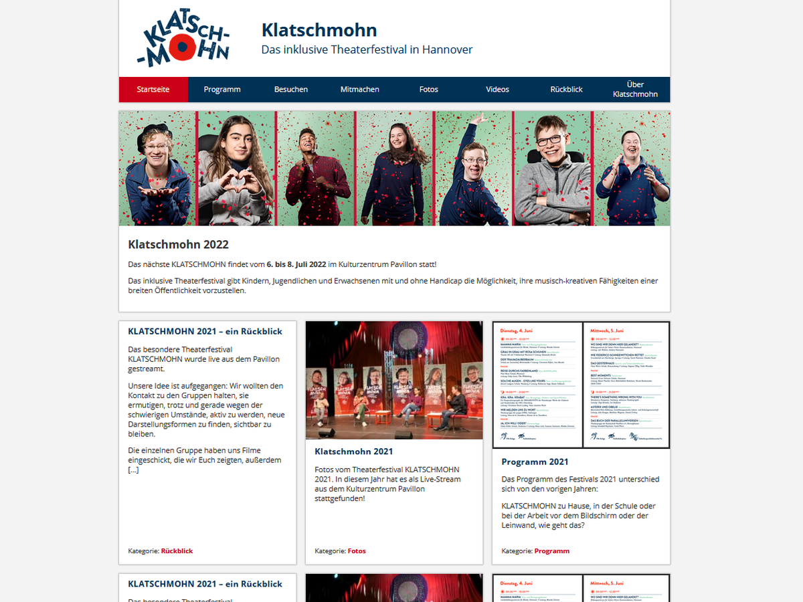

# Klatschmohn 22

A wordpress theme build for [projekttheater-klatschmohn.de](https://projekttheater-klatschmohn.de/),

> note: This theme is created for this specific site. Not tested for other use cases.

## Use

- Download 'dist' folder
- Rename to 'klatschmohn_22'
- Copy to 'themes' folder in your wordpress installation
- Activate

## Edit

- Clone Repo
- Install dependencies `npm install`
- Start watcher `npm run dev`
- Edit files in `src`

## Tools

- npm
- gulp
- webpack

## Licence

### Code

klatschmohn 22 - A wordpress theme -
Copyright (C) 2022 pixel-fabian

This program is free software: you can redistribute it and/or modify
it under the terms of the GNU General Public License as published by
the Free Software Foundation, either version 3 of the License, or
(at your option) any later version.

This program is distributed in the hope that it will be useful,
but WITHOUT ANY WARRANTY; without even the implied warranty of
MERCHANTABILITY or FITNESS FOR A PARTICULAR PURPOSE. See the
GNU General Public License for more details.

You should have received a copy of the GNU General Public License
along with this program. If not, see <https://www.gnu.org/licenses/>.

### Assets

The Klatschmohn logo and favicons belong to [projekttheater-klatschmohn.de](https://projekttheater-klatschmohn.de/)

### Fonts

This theme uses:

- [Fork Awesome](https://forkaweso.me/Fork-Awesome/)
- [Open Sans](https://fonts2u.com/open-sans.font)
